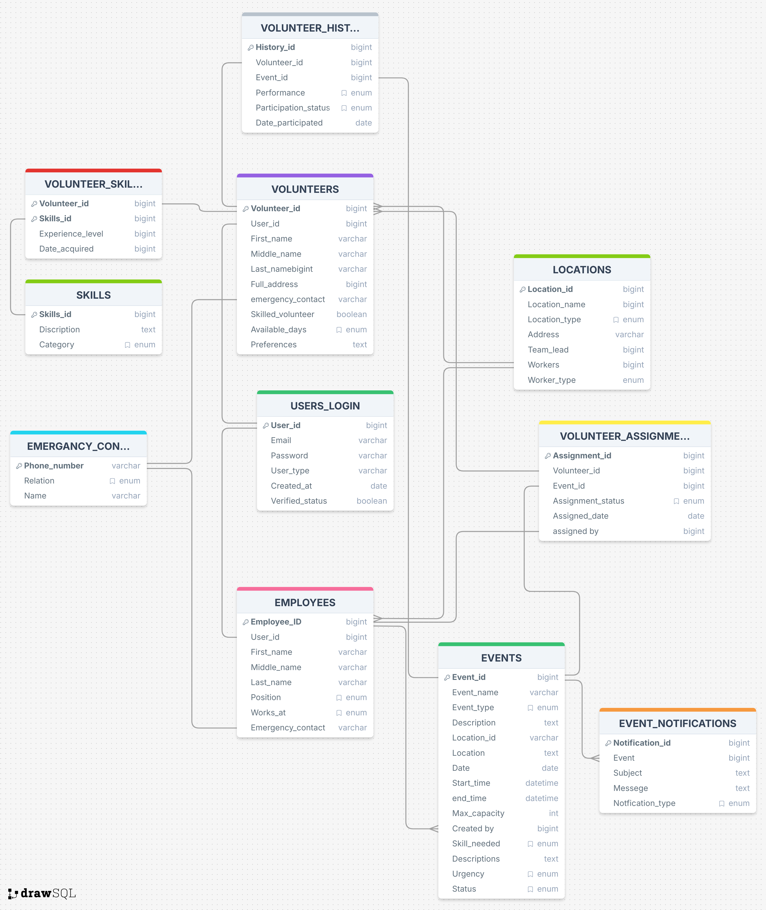

# COSC 4353 Project - Volunteer App - Group 10

## Team:
- **Javier Alvarez**
- **Tadiwa Kabayadondo**
- **Tabriz Sadredinov**
- **Mohamed Uddin**

We are designing a web application for a food bank-based nonprofit organization. The core users of the app will be volunteers and administrators. Since we are catering to a wide variety of users, the app will be simple but intuitive, with cross-platform functionality. The user will interact with the web app, where every volunteer will have a profile with their details for them to register, login and sign up for various events and Admins can create and manage events, specifying required skills, location, and urgency. 


## High-Level Design / Architecture:

- Data Layer (MySQL + Azure) 
    - Database which stores user information such as login info, profiles, events, notifications, etc. 
- Data Access Layer (Query / CRUD) 
    - Involves querying the database for specific data to be used on Service / Business layers.
- Service Layer (Express.js / Node.js)
    - Involves use of Express.js in order to provide services
    - Services include:
        - Notification services
        - Authentication services (Firebase) 
        - Matching services 
        - Google Maps API services 
- Business Layer (Event + Volunteer Logic)
    - Involves event and volunteer management.
    - Event Management:
        - Admins create events which are stored in the Events table 
    - Volunteer Management:
        - Volunteer info stored in the Volunteers table 
- Presentation Layer (Frontend: React + TailwindCSS)
    - Main features include: 
        - Login/Signup
        - Profile management 
        - Event browsing / signup / history / posting (for admins) 
        - Notifications 
    - Web application hosted on Vercel

## Features/Commponent Interaction:
- **Login**: Volunteers, employees, or admins can register and back-end authenticates, then db stores the account 
- **Profile** Management: volunteers can update personal info, location, skills, and availability, which is saved in the db. 
- **Events**: Employees create events with the location, type, description, and urgency, and it’s stored in the EVENTS table.  
- **Matching**: The matching module queries the db for best volunteers based on an event's requirements. 
- **Notifications**: There will be back-end calls for notifications/emails to the API which will send event reminders.  
- **History**: During or after event creation/completion, it’s going to be recorded in the status attribute of the EVENTS table.

## Tech Stack

### Frontend
- JS/React
- Tailwind CSS
- Firebase Authentication

### Backend
- Node.js/Express.js
- MySQL database

### API's and external services
- Google Maps API for geolocation and distance matching
- Azure Database for hosting
- Vercel for deployment

---

## Database Schema

*Also available in https://drawsql.app/teams/javiers-team-13/diagrams/food-bank
---
## For the group:

```bash
git clone https://github.com/tabriz-s/foodbank-volunteer-app.git
npm run install:all
```

- Create .env files in both client/ and server/ (see .env.example for reference)
```bash
# Copy environment templates
cp .env.example client/.env
cp .env.example server/.env
```

```bash
npm run dev
```

### Git workflow (not strictly necessary):

```bash
# 1. pull the latest code
git checkout main
git pull origin main

# 2. Create a new branch for your feature. Ex:
git checkout -b feature/user-authentication
# or 
git checkout -b feature/whatever-the-feature-is

# 3. Work on your feature...

# 4. Commit and push
git add .
git commit -m "Add: Firebase user authentication"
git push origin feature/user-authentication

# 5. Create a Pull Request on GitHub

# 6. After merge is approved
git checkout main
git pull origin main
git branch -d feature/user-authentication
```

#### Commit message format:

Type: Brief description
- Detailed change 1
- Detailed change 2
- Any breaking changes

Types: Add, Update, Fix, Remove

#### For small changes, just commit directly to main:

```bash
git pull origin main
# Make your small change
git add .
git commit -m "Fix: typo in README"
git push origin main
```
